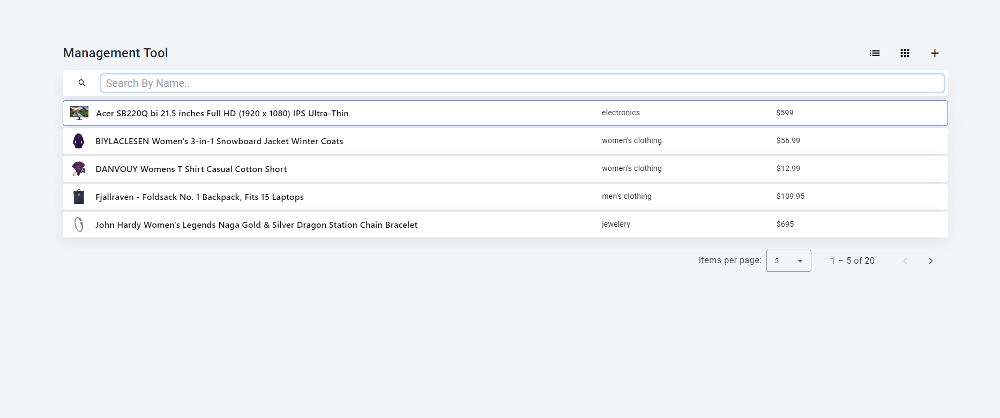

# Products Dashboard



## Overview

This Angular project is a Products Dashboard that allows users to perform simple CRUD operations on a list/grid view of products. Products are fetched from a free API called [Fake Store API](https://fakestoreapi.com/products). The project utilizes Angular, Angular Material, NgRx for state management, and RxJS for handling asynchronous operations.

## Features

- View products in list or grid layout
- Add new products
- Edit existing products
- Delete products
- Toggle between list and grid view
- Local storage for storing fetched products (reset on refresh)

## Installation

1. Clone the repository:

   ```bash
   git clone https://github.com/elhananperelprivate/products-dashboard.git

2. Navigate to the project directory:
   ```bash
   cd products-dashboard
   
3. Install dependencies:
   ```bash
   npm install

4. Run The Project
   ```bash
   ng serve

5. Open your browser and navigate to [LocalHost](http://localhost:4200/) to view the application.

